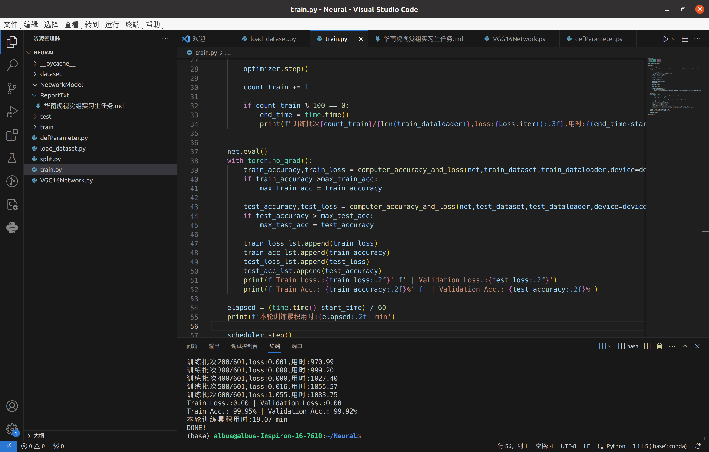

# 华南虎视觉组实习生任务报告

实习生姓名：蔡泽林

## 一、公共任务

### 装甲板识别

1. 代码思路：
           分别建立图像预处理、灯条旋转矩形、装甲板旋转矩形、二维坐标和三维坐标五个函数用于对视频装甲板进行处理识别  
           图像预处理：对其进行矫正畸变、通道分离、二值化处理，最后用开运算对图像进行形态学腐蚀和膨胀操作   
           灯条旋转矩形：先用findcontours函数找出两灯条的轮廓，然后根据面积和长宽比双重条件对等条进行筛选，给图像去噪，建立出两灯条的旋转矩形   
           装甲板旋转矩形：根据建立的灯条旋转矩形的中心点，旋转角度等，建立装甲板范围的旋转矩形   
           二维坐标：将确定的装甲板旋转矩形四个角的坐标存入二维坐标平面点集中，并用line函数画出装甲板的位置
           三维坐标：确定并建立世界坐标系   
           主函数中，导入视频后用对应的函数对视频进行加工处理，最后使用solvePnP函数解析出相机的姿态（旋转向量R和平移向量T），根据得到的T值计算出对应的装甲板到镜头的距离

2. 遇到问题:装甲板的识别并不稳定，时有时无  
           装甲板在移动的瞬间难以测距
3. 解决思路：
           暂时没有想到好的解决方法和思路

4. 效果图
5. 
6. 总结

## 二、专属方向（神经网络）任务

1. 代码思路:(1)首先构建神经网络框架模型，我这里采用了VGG16的卷积模型，构建出相应的神经网络(对应专属任务中的3.7.1，文件代码
           对应为VGG16Network.py)
           (2)然后对给出的装甲板数据集进行划分，按4:1的比例将数据集划分为训练集和测试集(文件代码对应为split.py)
           (3)接下来加载划分好的数据集，其中由于GPU内存有限，故而每次加载16张图片进行训练，即batch_size=16(文件代码对应
           为load_dataset.py)
           (4)然后设置使用GPU运算，并实例化神经网络，定义损失函数loss以及学习率为0.001，使用Adam优化器，定义学习率衰减方法StepLR并最后设置训练轮数,其中使用梯度下降算法计算精度及loss函数(对应文件代码为defParameter.py)
           (5)开始进行训练，首先将网络设置为训练模式，当网络包含 Dropout, BatchNorm时必须设置，然后进行通道转换，将图像和标签移动到指定设备上。接着将梯度清零，也就是把loss关于weight的导数变成0.，进⾏下⼀次batch梯度计算的时候，前⼀个batch的梯度计算结果，没有保留的必要了，所以在下⼀次梯度更新的时候，先使⽤optimizer.zero_grad把梯度信息设置为0。最后获取网络输出和损失，然后反响传播。记录每轮训练批次数，每100次进行一次输出，计算出训练精度和测试精度，更新出最高精度，每一次训练结束后更新学习率。
2. 遇到问题:(1)在训练过程中报错过GPU内存不够的问题
           (2)无法均分红蓝装甲板的数据集  
3. 解决思路:对于问题(1),直接将batch_size调小即可解决，问题(2)暂时还没有好的解决方案
4.  效果图

1. 总结

## 三、总结

运行效果地址：

git仓库地址：

